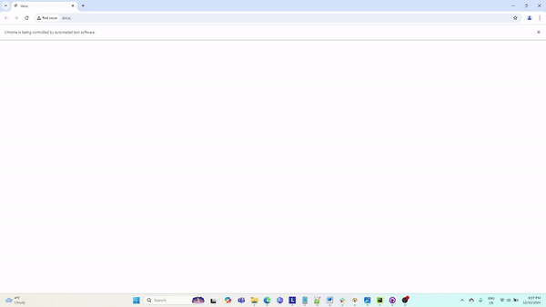

# Twitch Automation

This project was created as part of the interview process for Sporty.

## Project Overview

The task was to create a **WAP (Web Application for Phones) test** based on a provided test case.
A key requirement was that the test must use the mobile emulator in Google Chrome.

The main tools used for solving this task were **Python**, **Pytest** as the test runner, and the **Selenium** library for interacting with UI elements.

During the development of the framework, the **Page Object Model (POM)** design pattern was employed, as it is a standard approach for UI tests of this type.

## How to Run the Tests
After cloning the project, execute the following commands to run the tests:

**Linux/Mac Environment:**\
python3 -m venv venv\
source venv/bin/activate\
pip install -r requirements.txt\
pytest test_poems.py

**Windows Environment:**\
python3 -m venv venv\
venv\Scripts\activate\
pip install -r requirements.txt\
pytest test_poems.py

## A GIF of the test execution.

